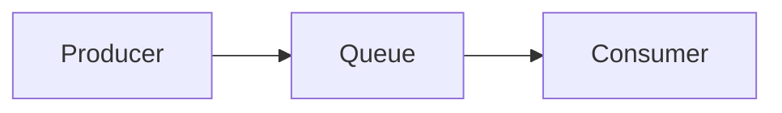
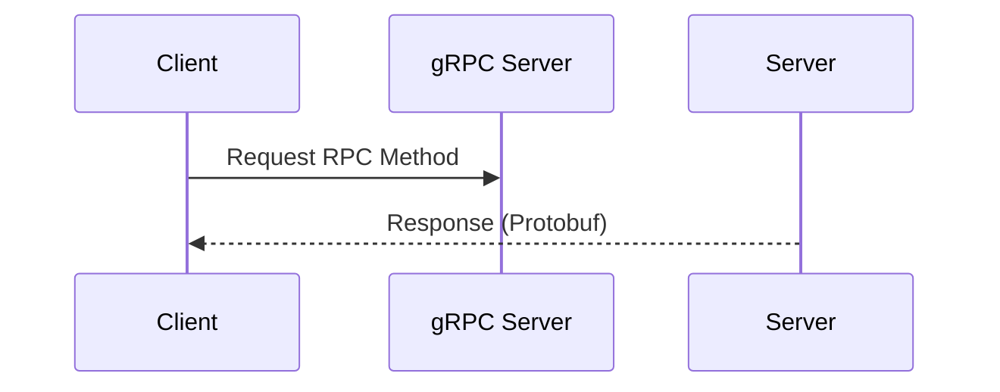
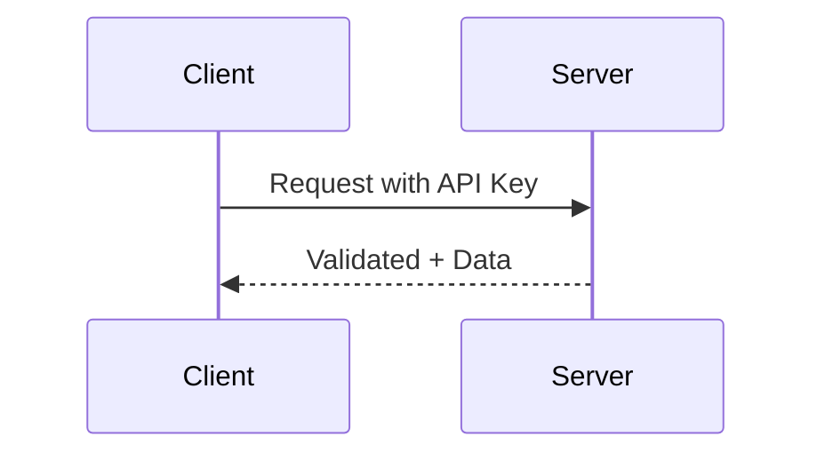
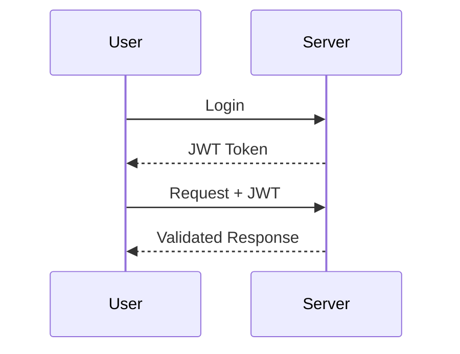
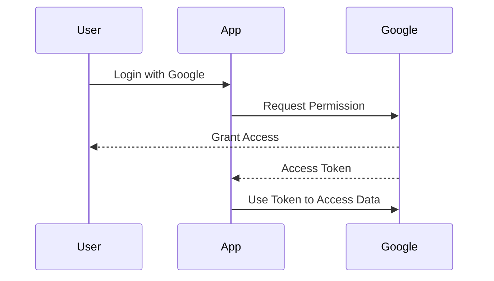
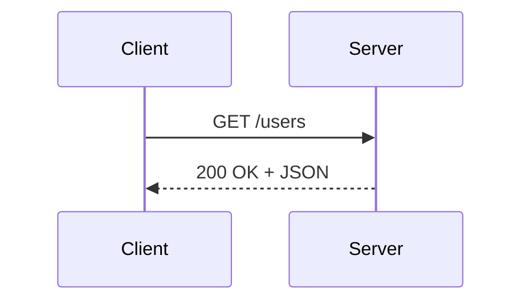

# 🌐 The Ultimate API Handbook: Protocols, Authentication & Types

> Comprehensive guide covering API protocols, authentication methods, and API types.

---

## 📖 Table of Contents

1. [Introduction](#introduction)
2. [API Protocols](#api-protocols)
   - [HTTP/HTTPS](#httphttps)
   - [WebSockets](#websockets)
   - [AMQP](#amqp)
   - [gRPC](#grpc)
3. [API Authentication](#api-authentication)
   - [API Keys](#api-keys)
   - [JWT Tokens](#jwt-json-web-tokens)
   - [OAuth](#oauth-open-authorization)
4. [Types of APIs](#types-of-apis)
   - [REST API](#rest-api)
   - [SOAP API](#soap-api)
   - [gRPC API](#grpc-api)
   - [GraphQL API](#graphql-api)
   - [WebHooks API](#webhooks-api)
   - [WebSockets API](#websockets-api-1)
   - [WebRTC API](#webrtc-api)
5. [Comparison Tables](#comparison-tables)
6. [Real-Life Use Cases](#real-life-use-cases)
7. [Conclusion](#conclusion)

---

## 📌 Introduction

APIs (Application Programming Interfaces) allow software applications to communicate and share data seamlessly. They form the **backbone of modern applications**, enabling integration between services, applications, and devices.

This guide provides detailed explanations of API **protocols**, **authentication mechanisms**, and **types of APIs**, with diagrams, tables, and real-world examples.

---

## ⚡ API Protocols

Protocols define the rules and standards for communication between clients and servers.

### 🔹 HTTP/HTTPS
- **Model:** Request–Response (stateless)
- **Methods:** `GET`, `POST`, `PUT`, `DELETE`, `PATCH`
- **Security:** HTTPS encrypts traffic with TLS/SSL
- **Best For:** Web APIs, REST services

```mermaid
sequenceDiagram
Client->>Server: GET /users
Server-->>Client: 200 OK + JSON data
````

---

### 🔹 WebSockets

* **Model:** Persistent bidirectional connection
* **Best For:** Real-time applications like chat, gaming, live dashboards
* **Advantages:**

  * Server can push updates instantly
  * Reduces bandwidth vs polling

```mermaid
sequenceDiagram
Client->>Server: Handshake
Server-->>Client: Connection Established
Client->>Server: Message
Server->>Client: Real-time update
```

---

### 🔹 AMQP (Advanced Message Queuing Protocol)

* **Model:** Queue-based message broker
* **Use Case:** Asynchronous communication, guaranteed message delivery



* **Best For:** Payment systems, notifications, decoupled microservices

---

### 🔹 gRPC

* **Model:** Remote Procedure Call over HTTP/2
* **Key Feature:** Uses **Protocol Buffers** for compact binary serialization
* **Best For:** Microservices and server-to-server communication



---

## 🔐 API Authentication

Authentication controls **who can access an API** and **what they can do**.

### 🔹 API Keys

* **Description:** Simple secret string for app identification
* **Pros:** Easy to implement
* **Cons:** Weak if exposed
* **Best For:** Public APIs, internal tools



---

### 🔹 JWT (JSON Web Tokens)

* **Structure:** Header.Payload.Signature
* **Flow:**

  1. Login → server generates JWT
  2. Client stores JWT
  3. JWT sent with requests
  4. Server verifies signature



* **Pros:** Stateless, scalable
* **Use Cases:** Web and mobile apps

---

### 🔹 OAuth (Open Authorization)

* **Idea:** Allow apps to access user data without sharing passwords
* **Flow:**



* **Pros:** Highly secure, permission-based
* **Use Cases:** Third-party login, external service integrations

---

## 🏗️ Types of APIs

### 🔹 REST API

* Stateless, resource-based, uses HTTP verbs
* **Pros:** Easy, scalable, widely adopted
* **Cons:** Overfetching/underfetching



---

### 🔹 SOAP API

* XML-based, strict contract
* **Pros:** Reliable, secure, error handling built-in
* **Cons:** Heavyweight, verbose
* **Best For:** Enterprise applications, finance, healthcare

---

### 🔹 gRPC API

* Uses Protobuf + HTTP/2
* **Pros:** Fast, supports streaming
* **Cons:** Less browser-friendly
* **Best For:** Microservices, internal APIs

---

### 🔹 GraphQL API

* Client queries exactly what it needs
* **Pros:** Solves overfetching/underfetching, single endpoint
* **Cons:** Caching and complexity
* **Best For:** Frontend-heavy apps, mobile apps

---

### 🔹 WebHooks API

* **Reverse API:** server notifies client
* **Pros:** Real-time, event-driven
* **Best For:** CI/CD, notifications

---

### 🔹 WebSockets API

* Persistent two-way connection
* **Best For:** Chat, dashboards, real-time updates

---

### 🔹 WebRTC API

* Peer-to-peer communication
* **Best For:** Video calls, screen sharing, gaming

---

## 📊 Comparison Tables

### Authentication Methods

| Method  | Security | Stateless | Use Case                 |
| ------- | -------- | --------- | ------------------------ |
| API Key | Low      | ✅         | Simple APIs              |
| JWT     | Medium   | ✅         | Web/Mobile apps          |
| OAuth   | High     | ✅         | Third-party integrations |

### API Types Overview

| Type      | Format | Real-time | Use Case         |
| --------- | ------ | --------- | ---------------- |
| REST      | JSON   | ❌         | Web/Mobile       |
| SOAP      | XML    | ❌         | Enterprise       |
| gRPC      | Binary | ✅         | Microservices    |
| GraphQL   | JSON   | ✅         | Frontend apps    |
| WebHook   | JSON   | ✅         | Event-driven     |
| WebSocket | Frames | ✅         | Chat/Dashboard   |
| WebRTC    | Peer   | ✅         | Video/Peer comms |

---

## 💡 Real-Life Use Cases

* WhatsApp/Slack → WebSockets
* PayPal/Banking → SOAP
* Netflix → gRPC
* Facebook/Instagram → GraphQL
* GitHub CI/CD → WebHooks
* Google Meet → WebRTC

---

## 🏁 Conclusion

* **Protocols** → define communication rules
* **Authentication** → define who accesses APIs
* **API Types** → choose architecture based on need

> APIs are the digital glue connecting modern apps. Use this guide as a **master reference** for design, implementation, and decision-making.

```
